# Documentação do Projeto: Sistema de Biblioteca

## Nome da Equipe: Os inquebráveis

## 1. Visão Geral e Proposta de Valor
   O "Sistema de Biblioteca" é uma aplicação web desenvolvida para a gestão completa do ciclo de vida de uma biblioteca, desde o cadastro de seus recursos (livros, leitores, funcionários) até a orquestração de suas operações centrais (empréstimos e devoluções).

O sistema foi concebido para transformar processos manuais em um fluxo de trabalho digital, eficiente e intuitivo. A proposta de valor não reside apenas na funcionalidade, mas em uma experiência de usuário (UX) que prioriza a clareza, a consistência e a tomada de decisão informada, capacitando a equipe da biblioteca a gerenciar o acervo e o relacionamento com os leitores de forma exemplar.

## 2. Arquitetura da Aplicação

**Backend**: A lógica do servidor é gerenciada pelo Framework Django, escrito em Python. A arquitetura segue o padrão Model-View-Template (MVT) do Django, que promove uma separação clara das responsabilidades:

**Model**: Define a estrutura dos dados e a interação com o banco de dados.

**View**: Atua como o cérebro da aplicação, processando as requisições do usuário, executando a lógica de negócio e interagindo com os Models.

**Template**: A camada de apresentação (HTML), responsável por exibir os dados ao usuário de forma dinâmica.

**Frontend**: A interface é construída com HTML5, CSS3 e o framework Bootstrap 4, garantindo um design responsivo e moderno. Ícones da biblioteca Font Awesome foram utilizados para melhorar a usabilidade e a comunicação visual.

**Banco de Dados**: A persistência dos dados é gerenciada pelo sistema de banco de dados SQLite, o padrão de desenvolvimento do Django, que pode ser facilmente migrado para sistemas mais robustos como PostgreSQL ou MySQL em um ambiente de produção.

## 3. Modelo de Dados e Integração com o Banco
   A integração com o banco de dados é um dos pontos mais fortes do Django, abstraída através do seu ORM (Object-Relational Mapper). Isso nos permitiu definir a estrutura dos nossos dados diretamente em código Python, sem a necessidade de escrever SQL manualmente.

O processo de integração ocorreu da seguinte forma:

Definição dos Modelos: No arquivo biblioteca/models.py, definimos as classes que representam nossas tabelas no banco:

**Funcionario**: Armazena dados do pessoal administrativo, incluindo informações para um sistema de login customizado.

**Leitor**: Contém as informações dos usuários que podem pegar livros emprestados.

**Livro**: Representa cada obra no acervo, com detalhes como ISBN, autor e, crucialmente, um campo de status ('disponivel' ou 'emprestado').

**Emprestimo**: O modelo central que conecta tudo. Ele usa ForeignKey para criar relações com Livro, Leitor e Funcionario, registrando quem pegou o quê, quando, e qual o estado atual da transação (EMPRESTADO, DEVOLVIDO, ATRASADO).

**Geração das Migrações**: Após cada alteração nos modelos, o comando python manage.py makemigrations era executado. Ele analisava as mudanças no código Python e gerava um "plano de migração", um arquivo com as instruções para alterar a estrutura do banco de dados.

**Aplicação no Banco**: O comando python manage.py migrate executava esse plano, aplicando as alterações e garantindo que o banco de dados estivesse sempre sincronizado com nossos modelos.

Essa abordagem nos deu agilidade e segurança, permitindo a evolução do nosso esquema de dados de forma controlada e versionada.

## 4. Estrutura de Funcionalidades e Design
   O funcionamento do sistema foi meticulosamente planejado para ser modular e consistente.

**Autenticação**: Implementamos um sistema de login e sessão customizado, onde o acesso às áreas administrativas é protegido, garantindo que apenas funcionários logados possam gerenciar o sistema.

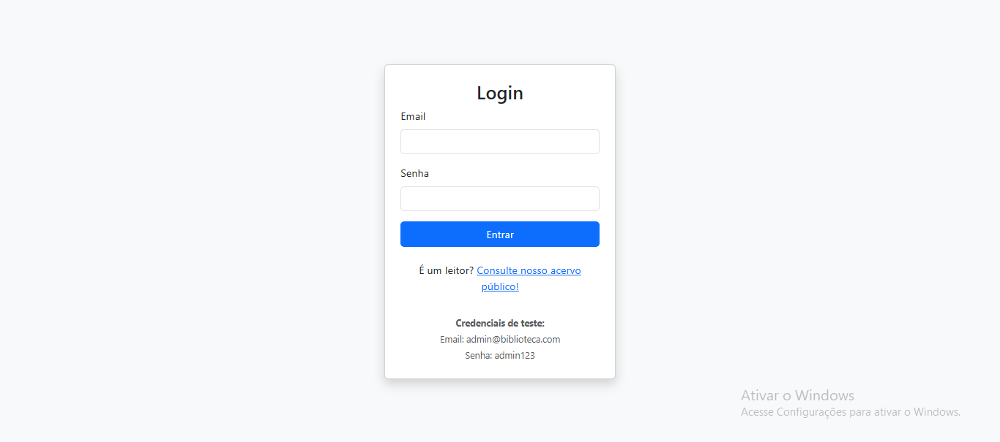

**Dashboard (Painel de Controle)**: A página inicial para usuários logados foi transformada de um simples menu em um dashboard estratégico. Ele apresenta KPIs (Indicadores de Performance Chave) em tempo real, como o total de livros e os empréstimos ativos/atrasados, e destaca as ações prioritárias, como as devoluções pendentes.

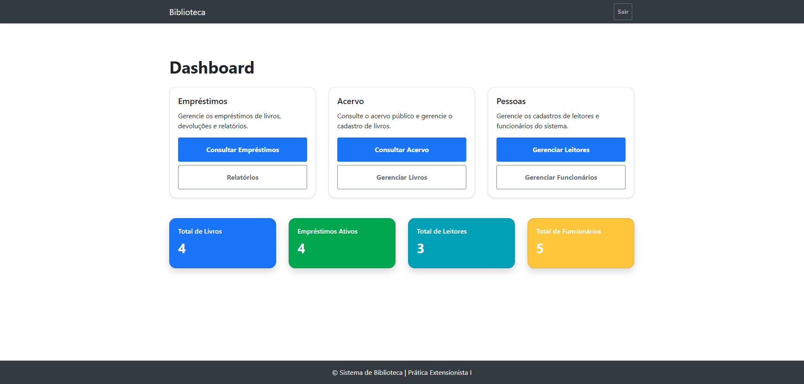

**Páginas Iniciais de Gerenciamento de Livros, Leitores e Funcionários**: Permite que o usuário cadastre, atualize, consulte e exclua informações:

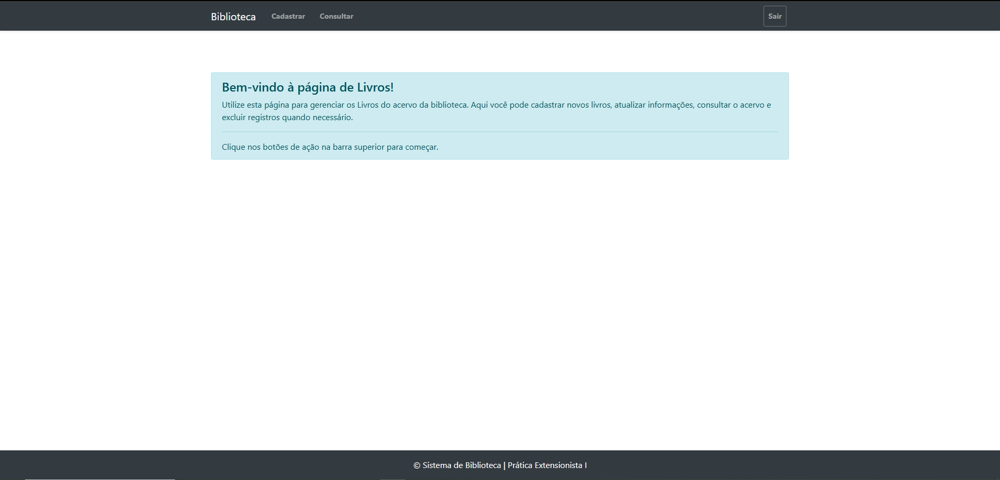
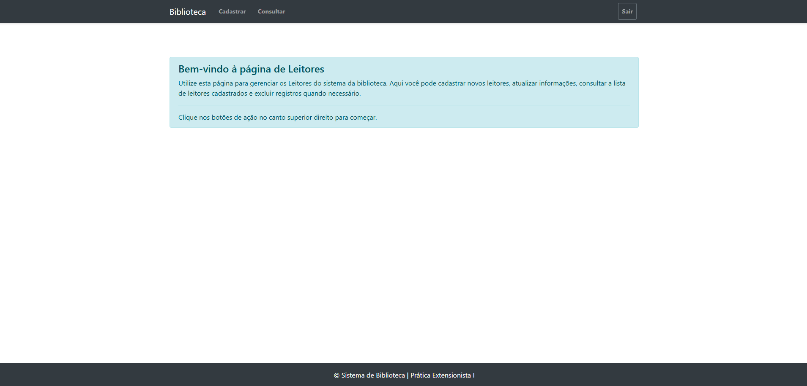
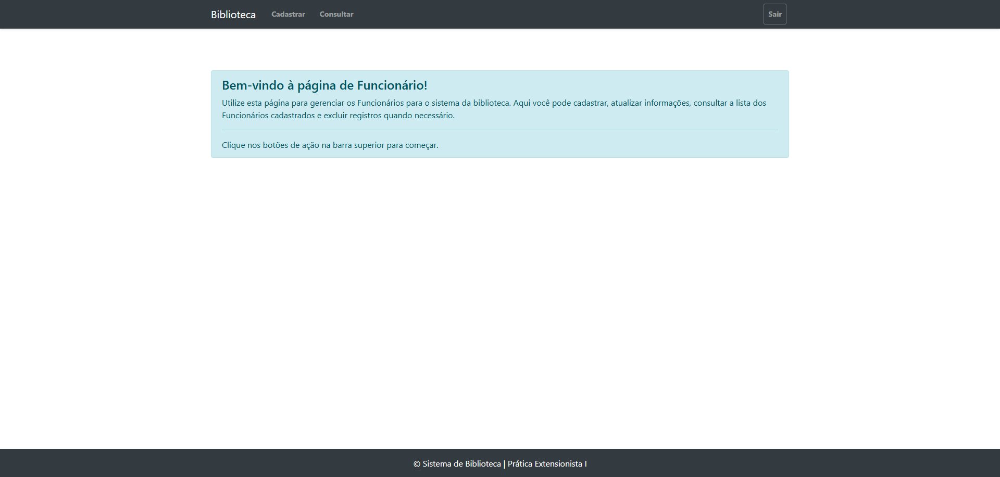

**Módulos de Gerenciamento (CRUDs)**: As seções de Funcionários, Leitores e Livros seguem um padrão de design de excelência e consistente:

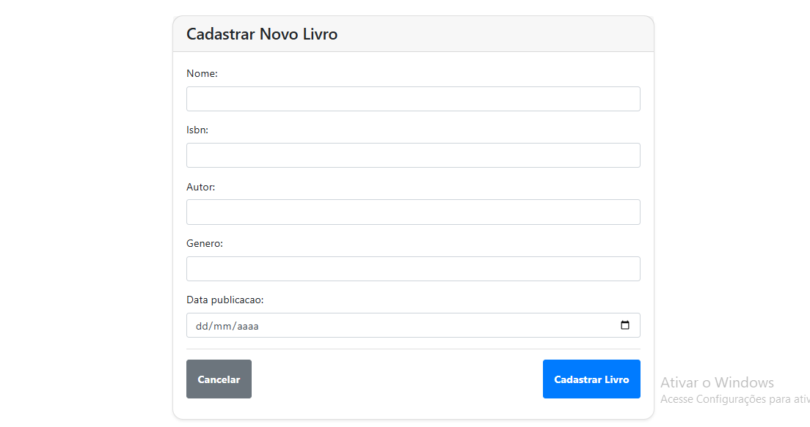
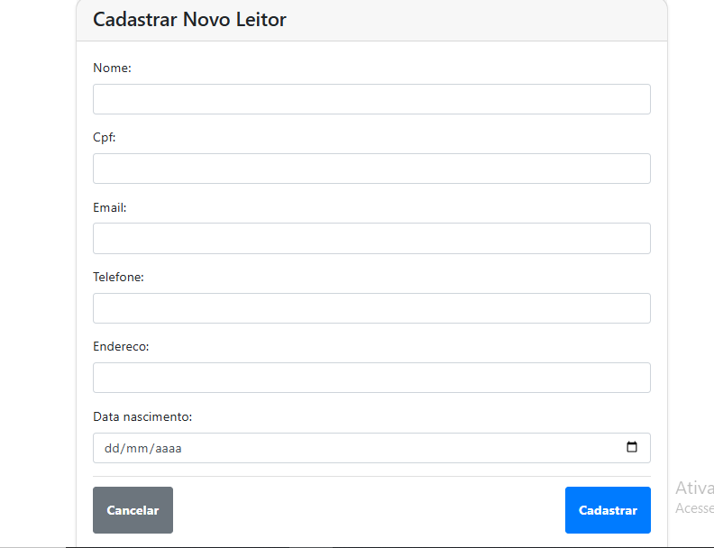
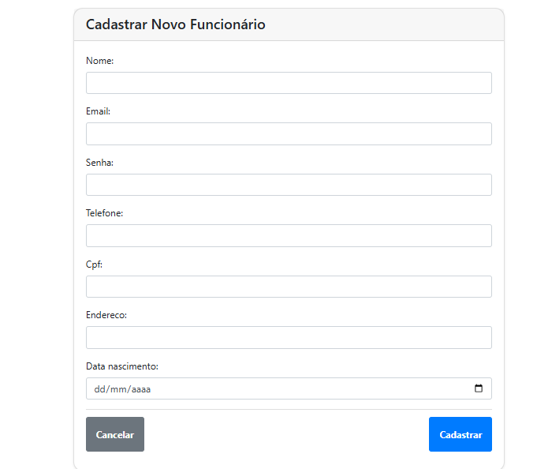

Formulários Sofisticados: Os formulários de cadastro e atualização foram refinados para incluir um design limpo, botões de ação claros ("Cancelar" e "Cadastrar") e uma melhor experiência de usuário através de estilos CSS para o estado de :focus dos campos.

**Consultar CRUDs já realizados**: Permite Gerenciar Livros, Leitores e Funcionários:

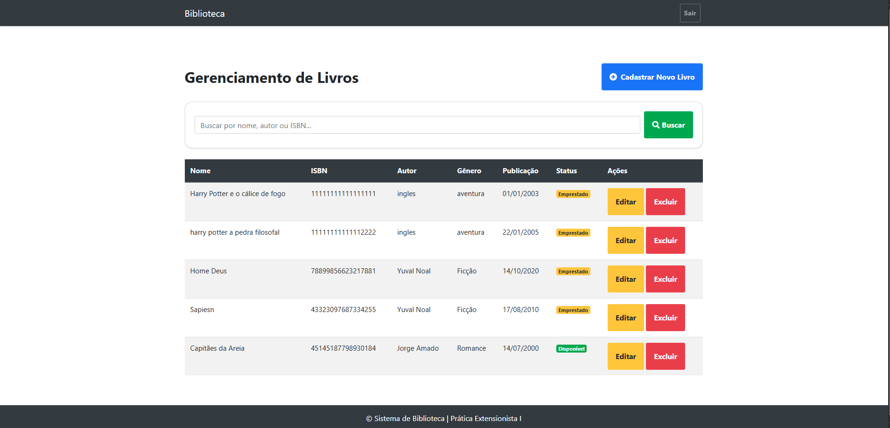
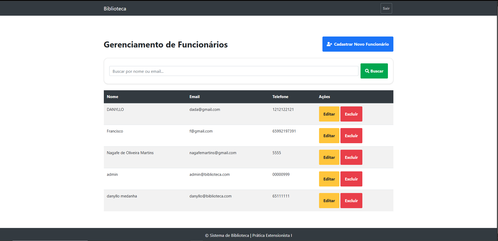
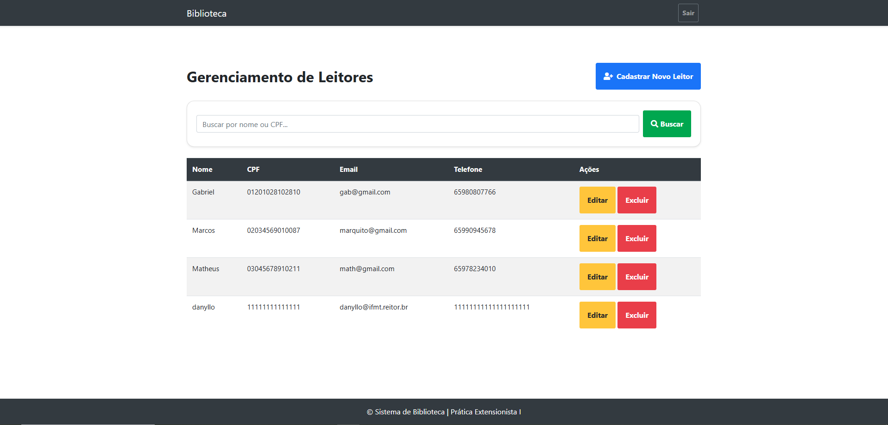

Um cabeçalho de página une o título à ação principal (ex: "Gerenciamento de Livros" ao lado de "Cadastrar Novo Livro").

Uma área de controle destacada em um card abriga a funcionalidade de busca.

A exibição de dados utiliza layouts modernos (listas de cards ou tabelas aprimoradas) que comunicam o status dos itens através de cores e badges.

**Gerencimento de Empréstimos**: Permite as visualizações dos empréstimos categorizados como: "Em Andamento", "Atrasados", "Histórico"

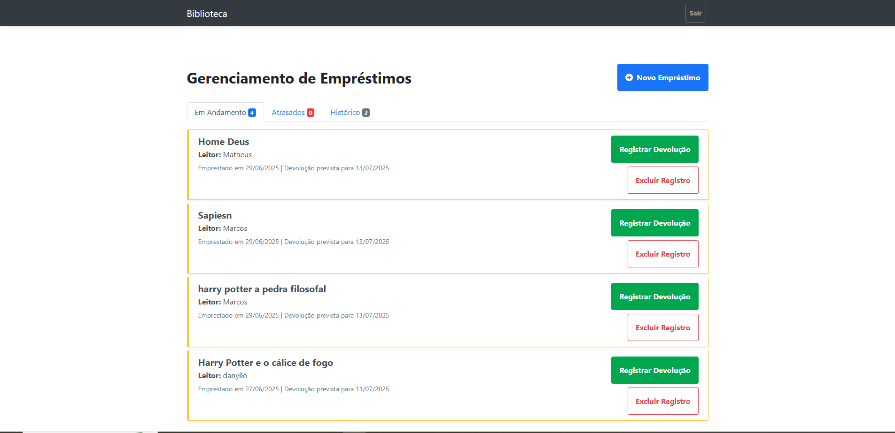
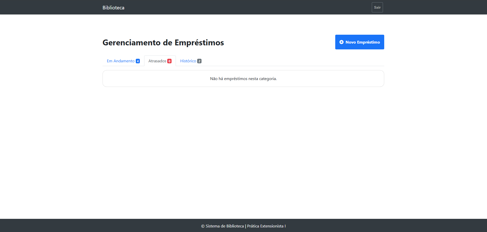
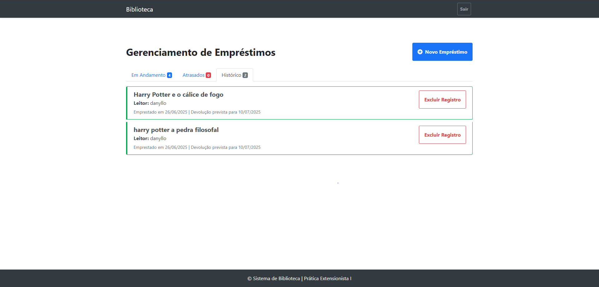

**Relatórios e Acervo**: Criamos uma "Central de Relatórios" informativa e um "Acervo Público" visualmente agradável, com busca e layout de cards, separando a visão do leitor da visão do administrador.

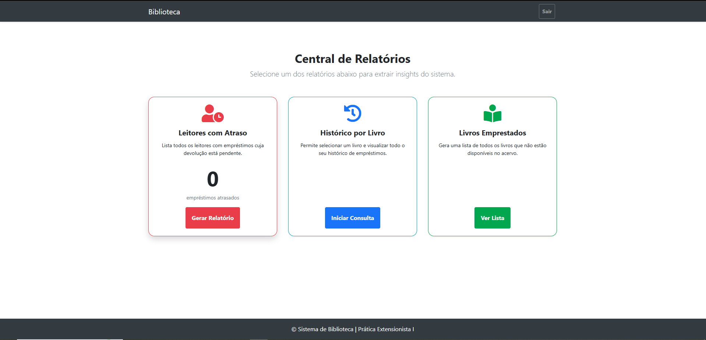

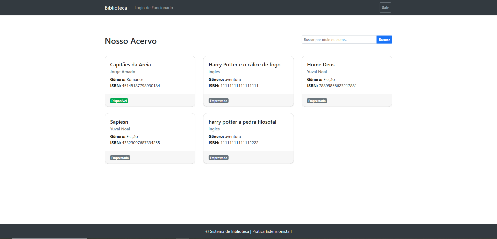

## Resultados e Desafios

O principal resultado deste projeto é a entrega de um Sistema de Gestão de Biblioteca robusto e coeso, que evoluiu de um protótipo funcional para uma aplicação com uma interface de usuário de alto padrão, dotada de um dashboard estratégico, relatórios dinâmicos e fluxos de trabalho intuitivos. Os desafios superados foram cruciais para este amadurecimento. Tecnicamente, a depuração sistemática de erros de estado de sessão e de configuração de rotas do Django, como NoReverseMatch e TemplateDoesNotExist, solidificou a base da aplicação. Conceitualmente, o maior desafio foi o próprio processo de design iterativo: a busca contínua pelo equilíbrio entre a inovação estética e a usabilidade prática, o que nos levou a refinar e, por vezes, reverter decisões de design para alcançar o alinhamento perfeito com a visão do usuário, transformando cada obstáculo em um degrau para a excelência do produto final.

# Tutorial de uso e Ativação Local

Este tutorial ira guiar voce na clonagem do repositorio do Yapper, instalacao das dependencias e como rodar a aplicacao em seu ambiente de desenvolvimento local.
## Pré-requisitos

Antes de comecar, certifique-se de ter os seguintes programas instalados em seu sistema:

* **Python 3.x:** Recomenda-se a versao 3.10 ou superior. (A versao utilizada no projeto foi Python 3.13.5).
* **pip:** O gerenciador de pacotes do Python (Para conferencia do pip -> "pip –version").
* **Git:** Para clonar o repositorio do GitHub.

## Passos para Configuração:

1.  **Clonar o Repositorio:**
    Abra seu terminal ou prompt de comando. Escolha um diretorio onde voce deseja armazenar o projeto e execute o comando Git para clonar o repositorio do Yapper:
    ```bash
    git clone https://github.com/Danyllo-Mendanha-dev/Danyllo-Mendanha-dev.git
    ```

2.  **Navegar para o Diretorio do Projeto:**
    Apos a clonagem, navegue para o diretorio do projeto Yapper:
    ```bash
    cd ProjetoPraticaExtensionista
    cd ProjetoPraticaExtensionista
    cd Biblioteca
    ```

3.  **Criar e Ativar Ambiente Virtual:**
    E uma boa pratica criar um ambiente virtual para isolar as dependencias do projeto das dependencias globais do seu sistema.

    * Crie o ambiente virtual:
        ```bash
        python -m venv virtual
        ```
    * Ative o ambiente virtual:
        * **No Windows:**
            ```bash
            virtual\Scripts\activate
            ```
        * **No macOS/Linux:**
            ```bash
            source virtual/bin/activate
            ```
    (Voce deve ver `(virtual)` no inicio da linha de comando, indicando que o ambiente esta ativo.)

4.  **Instalar Dependencias:**
    Com o ambiente virtual ativado, instale apenas a biblioteca de instalação do DJANGO:
    ```bash
    pip install django
    ```

5.  **Configurar Banco de Dados e Migracoes:**
    O projeto utiliza SQLite3 como banco de dados. E necessario aplicar as migracoes para criar as tabelas no banco de dados local.

    ```bash
    python manage.py makemigrations
    python manage.py migrate
    ```

6.  **Criar um Usuario Administrador (Superuser): (Opcional)** 
    Para acessar o painel de administracao do Django e criar usuarios inicialmente, voce precisara de um superusuario.
    ```bash
    python manage.py createsuperuser
    ```
    Siga as instrucoes no terminal para criar seu username, endereco de email (opcional) e senha.

7.  **Rodar o Servidor Local:**
    Agora voce pode iniciar o servidor de desenvolvimento do Django:
    ```bash
    python manage.py runserver
    ```
    O servidor estara rodando e observando por alteracoes nos arquivos.

8.  **Acessar a Aplicacao:**
    Abra seu navegador da web e acesse o endereco:
    ```
    Local: http://127.0.0.1:8000
    ```
    Voce sera redirecionado para a tela de login

